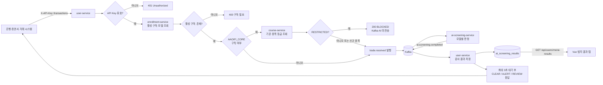
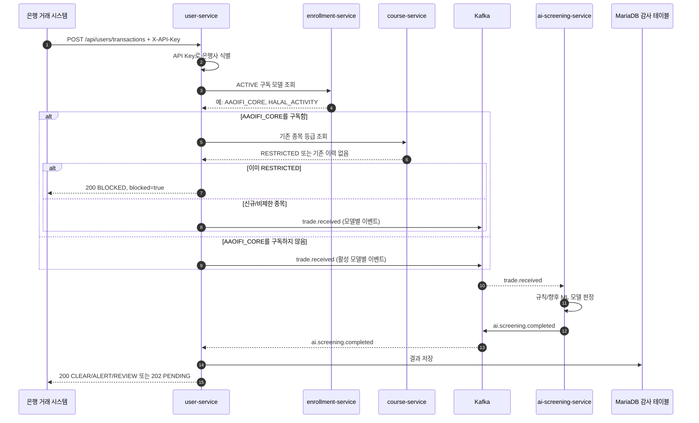

# ShariahGuard 시스템 구조와 변경 범위

## 1. 최초 프로젝트 대비 변경 범위

이 저장소에는 최초 `msa-lecture` 상태의 Git 커밋 또는 태그가 남아 있지 않다. 따라서 **정확한 파일별/줄별 diff 수치는 산출할 수 없다.**

현재 Java, Vue, Python 소스는 약 **7,194줄**이며, `SHARIAH-SCREENING-CHANGES.md`와 현재 소스 구조를 기준으로 확인 가능한 기능 변경은 다음과 같다.

| 구분 | 최초 강좌 프로젝트 | 현재 ShariahGuard 프로젝트 |
|---|---|---|
| 고객 | 일반 수강생 | 은행·증권사 등 금융기관 |
| Course | 강좌 카탈로그 | 기존 제한 이력도 보관하는 종목 마스터 |
| Enrollment | 수강 신청 | 탐지 모델 구독. 레거시 주문 심사 호환 기능도 보존 |
| Payment | 결제 | 레거시 AAOIFI 규칙 심사·감사 이력 |
| Recommend | 강좌 추천 | 레거시 대체 종목 추천·이상 징후 처리 |
| User | 회원 관리 | 기관 계정, Client Code, API Key, AI 감사 결과 보관 |
| 신규 서비스 | 없음 | `ai-screening-service` (Kafka 기반 모델 판정 워커) |
| 프론트엔드 | 강좌 UI | 모델 구독, 탐지 결과, API 연동 관리 콘솔 |

### 유지한 부분

- Eureka, API Gateway, OAuth/JWT, MariaDB, Kafka 기반 MSA 뼈대
- 기존 서비스 이름, 기본 포트, 주요 URL 별칭
- `Course`, `Enrollment`, `Payment` 등 기존 도메인 클래스명 일부

### 크게 바뀐 부분

- API Key 기반 은행사 거래 수신 API: `POST /api/users/transactions`
- 은행사별 활성 구독 모델만 실행하는 필터
- 기존 `RESTRICTED` 종목 이력의 AAOIFI 사전 차단
- `trade.received` / `ai.screening.completed` Kafka 흐름
- AI 판정 결과를 `ai_screening_results`에 기관별로 저장하고 탐지 결과 탭에 표시
- AI 결과를 최대 3초 대기하여 외부 거래 API 응답에도 `CLEAR`, `ALERT`, `REVIEW`, `PENDING`으로 반환

## 2. 모듈별 책임

| 모듈 | 포트 | 현재 역할 | 주요 데이터/연동 |
|---|---:|---|---|
| `vue-frontend` | 3000 | 금융기관 콘솔. 모델 구독, 탐지 결과, API Key 연동 관리 | Gateway API, 개발 시 Vite 실행 |
| `api-gateway` | 8080 | OAuth JWT 검증, 사용자 API 라우팅 | 사전 빌드 이미지 (`infra-images.tar`) |
| `auth-server` | 9000 | 로그인·회원가입 후 OAuth2 Authorization Code / JWT 발급 | 사전 빌드 이미지 (`infra-images.tar`) |
| `eureka-server` | 8761 | 서비스 디스커버리 | 모든 서비스 등록 |
| `user-service` | 8081 | 기관 계정, API Key 인증, 거래 수신, 구독 확인, 사전 제한 필터, Kafka 발행, AI 결과 감사 저장 | `users`, `ai_screening_results`, `trade.received`, `ai.screening.completed` |
| `enrollment-service` | 8083 | 모델 구독의 생성·일시중지·해지 및 활성 구독 조회 | `orders` 테이블을 구독 저장소로 호환 사용 |
| `course-service` | 8082 | 종목 마스터와 기존 AAOIFI 종목 등급 보관 | `securities`, 기존 `RESTRICTED` 조회 |
| `ai-screening-service` | 8086 | 구독 모델별 거래 판정 워커. 현재는 규칙 기반이며 이후 ML 모델로 교체 가능 | Kafka consume/produce |
| `payment-service` | 8084 | 레거시 AAOIFI 규칙 평가·심사 이력 | `screenings`, `screening.completed` |
| `recommend-service` | 8000 | 레거시 대체 종목 추천·이상 징후 처리 | `anomaly.detected` |
| MariaDB | 3379 (호스트) | 서비스 영속 데이터 | Docker 볼륨 `mariadb_data` |
| Kafka | 9092 | 서비스 간 비동기 이벤트 브로커 | Docker 볼륨 `kafka_data` |

## 3. 모델 구독과 거래 판정 규칙

현재 기본 모델 코드는 다음 세 가지다.

| 모델 코드 | 목적 | 현재 임시 규칙 |
|---|---|---|
| `AAOIFI_CORE` | 기본 샤리아 적합성 | 금지 업종 탐지 |
| `HALAL_ACTIVITY` | 할랄 사업활동 | 알코올, 도박, 돼지고기, 담배 등 사업활동 신호 탐지 |
| `FINANCIAL_THRESHOLD` | 재무 한도 | 이자부채 33%·비허용 수익 5% 한도 확인 |

활성 구독 모델만 해당 은행사의 거래에 적용된다. 특히 기존 종목 마스터의 `RESTRICTED` 사전 차단은 `AAOIFI_CORE`가 활성 구독일 때만 수행한다.

## 4. 전체 플로우차트



## 5. 거래 API 시퀀스 다이어그램



## 6. 외부 거래 API 응답 계약

### 탐지 완료: `200 OK`

`ALERT`인 경우 은행 시스템은 `blocked: true`를 기준으로 거래를 차단하거나 보류 처리한다.

```json
{
  "success": true,
  "data": {
    "transactionId": "BANK-TRADE-001",
    "dispatchedModels": ["HALAL_ACTIVITY", "AAOIFI_CORE"],
    "blocked": true,
    "decision": "ALERT",
    "processingCompleted": true,
    "blockReason": "구독 모델의 이상 탐지 기준에 해당합니다",
    "results": [
      {
        "modelCode": "AAOIFI_CORE",
        "status": "ALERT",
        "reason": "AAOIFI 금지 업종 감지: CONVENTIONAL_FINANCE"
      }
    ]
  }
}
```

### 결과 대기 초과: `202 Accepted`

Kafka 소비·AI 처리·DB 저장이 3초 안에 끝나지 않으면 다음과 같이 반환한다. 결과는 이후 탐지 결과 탭에서 조회할 수 있다.

```json
{
  "success": true,
  "data": {
    "decision": "PENDING",
    "processingCompleted": false,
    "blocked": false
  }
}
```

## 7. 데이터 테이블

| 테이블 | 용도 |
|---|---|
| `users` | 금융기관 계정, 조직명, Client Code, BCrypt API Key 해시 |
| `orders` | 기존 수강 신청 테이블을 재사용한 모델 구독 및 레거시 주문 데이터 |
| `securities` | 종목 기본정보와 기존 샤리아 등급 |
| `screenings` | 레거시 payment-service 심사 이력 |
| `ai_screening_results` | 현재 Kafka AI 모듈이 생성한 은행사별 탐지·적합성 결과 |

## 8. 최초 실행 시 주의 사항

새 Docker 환경에서는 `infra-images.tar`에 포함된 auth-server·api-gateway 이미지를 먼저 로드한다.

```bash
docker load -i infra-images.tar
COMPOSE_PARALLEL_LIMIT=1 docker compose up -d --build
```

`mariadb_data` 볼륨이 없는 최초 실행에만 `init-db/01_init.sql`이 자동 실행된다. Maven Central `429 Too Many Requests`를 피하려면 처음에는 위처럼 Compose 빌드를 순차 실행하는 것을 권장한다.
